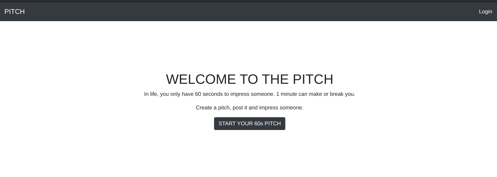

# PITCH
Pitch is a flask application that allows users to add pitches and other users able to vote on them. The pitches are categorized.

## Author
* Evans Onchagwa


### Pitch




## BDD
* Display pitches category.
* Display pitches.
* Selecting category.
* Adding comments.

## Input
* Enter your email address, username and passsword 
* Submit the form.
* Write down the pitch.
* Upvote, Downvote and comment.

## Output
* Sign Up,Sign In
* View posted pitches.
* Username.
* Upvote and downvote pitches
* Comment on a pitch.
* SignOut.


## Setup Requirements
  Here's a brief intro about what a developer must do in order to start running the app locally:

  ```
  $ git clone https://github.com/DjCooGie/Pitch.git
  $ cd Pitch/
  ```
  * create a virtual environment
  * Activate the virtual environment
  * create your own database
  * change or add configurations in the config.py file
  
  ```
  $ pip install -r requerements.txt
  $ chmod a+x start.sh
  $ ./start.sh
  ```
  
  ```
  $ python3.6 manage.py test (To run tests)
  ```
  
## Bug and Solution.
 No known bugs
   
## Technologies Used
  * [Python version 3.8.0](https://www.python.org/) . 
  * [Flask (Flas modules)](https://www.fullstackpython.com/flask.html).
  * PSQL database.
  * SQLAlembic.
  *Jinja2

 #### Known Bugs
No known bugs

## Live Site link
[https://evan-pitch-ups.herokuapp.com/](https://evan-pitch-ups.herokuapp.com/)

#### Collaborate
>Incase of any questions, problems ideas concerning the app, feel free to reach out to me:
>>Github: [Evans Onchagwa](https://github.com/jusinam)
>>Email: evansonchagwa01@gmail.com

#### License
MIT
&copy;2020 Evans Onchagwa
